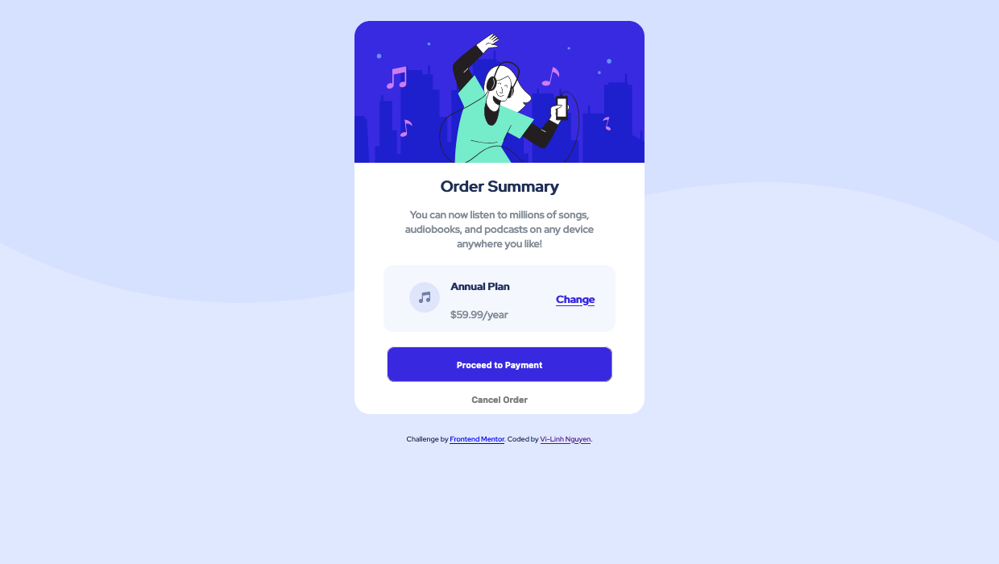
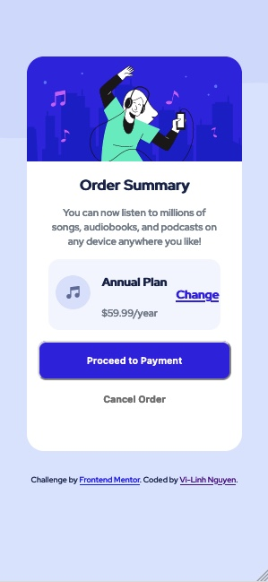

# Frontend Mentor - Order summary card solution

This is a solution to the [Order summary card challenge on Frontend Mentor](https://www.frontendmentor.io/challenges/order-summary-component-QlPmajDUj). Frontend Mentor challenges help you improve your coding skills by building realistic projects.

## Table of contents

- [Overview](#overview)
  - [The challenge](#the-challenge)
  - [Screenshot](#screenshot)
  - [Links](#links)
- [My process](#my-process)
  - [Built with](#built-with)
  - [What I learned](#what-i-learned)
  - [Continued development](#continued-development)
  - [Useful resources](#useful-resources)
- [Author](#author)

**Note: Delete this note and update the table of contents based on what sections you keep.**

## Overview

This is another newbie level challenge to help me get used to frontendmentor.io.
The styling guide was a bit vague but it's a fun challenge.

### The challenge

Users should be able to:

- See hover states for interactive elements

### Screenshot


desktop screenshot pictured above


mobile screenshot pictured above

### Links

- Live Site URL: [Add live site URL here](https://vilinh27.github.io/orderSummaryComponent/)

## My process

### Built with

- Semantic HTML5 markup
- CSS custom properties
- Flexbox

### What I learned

I still have issues with CSS details that involve centering html components vertically. Messing with margins tends to be tedious for me to begin with.

I did get to review how adding background images worked and their properties though. That was nice.

Overall, it's good to review foundational html and css stuff. I don't have this quite there, but I got like 99% of the original design, which is still a win for me.

To see how you can add code snippets, see below:

```css
body {
  background-color: hsl(225, 100%, 94%);
  font-family: "Red Hat Display", sans-serif;
  color: hsl(223, 47%, 23%);
  background-image: url("./images/pattern-background-desktop.svg");
  background-repeat: no-repeat;
  background-size: contain;
}
.main {
  margin: auto auto;
  display: flex;
  flex-direction: column;
  justify-content: center;
  align-items: center;
  align-content: center;
}
```

### Continued development

I'll look for more challenges to review CSS and further my knowledge into javascript and more complex web dev concepts.

### Useful resources

- [Flexbox demo](https://the-echoplex.net/flexyboxes/?fixed-height=on&display=flex&flex-direction=row&flex-wrap=nowrap&justify-content=space-around&align-items=center&align-content=center&order%5B%5D=0&flex-grow%5B%5D=0&flex-shrink%5B%5D=1&flex-basis%5B%5D=auto&align-self%5B%5D=auto&order%5B%5D=0&flex-grow%5B%5D=0&flex-shrink%5B%5D=1&flex-basis%5B%5D=auto&align-self%5B%5D=auto&order%5B%5D=0&flex-grow%5B%5D=0&flex-shrink%5B%5D=1&flex-basis%5B%5D=auto&align-self%5B%5D=auto) - Helps with flexbox demo
- [rem to px converter](https://nekocalc.com/rem-to-px-converter) - I'm more used to rem styling so this helps conversion
- [background image css](https://www.w3schools.com/cssref/pr_background-image.asp) - Don't use background image in styling often so this helped.
- [repeating background property](https://www.w3schools.com/cssref/pr_background-repeat.asp)-had a repeat background issue
- [background-image width](https://www.w3schools.com/howto/howto_css_full_page.asp)-background image provided didn't cover whole width so this helped with that

## Author

- Website - [Vi-Linh Nguyen](https://vilinh27.github.io/)
- Frontend Mentor - [@ViLinh27](https://www.frontendmentor.io/profile/ViLinh27)
- Twitter - [@vilinh27](https://twitter.com/vilinh27)
